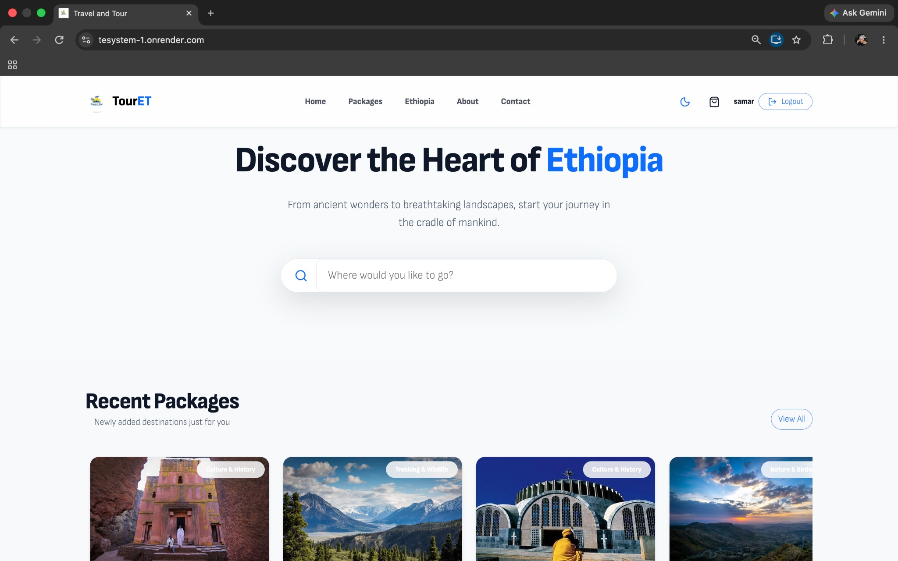
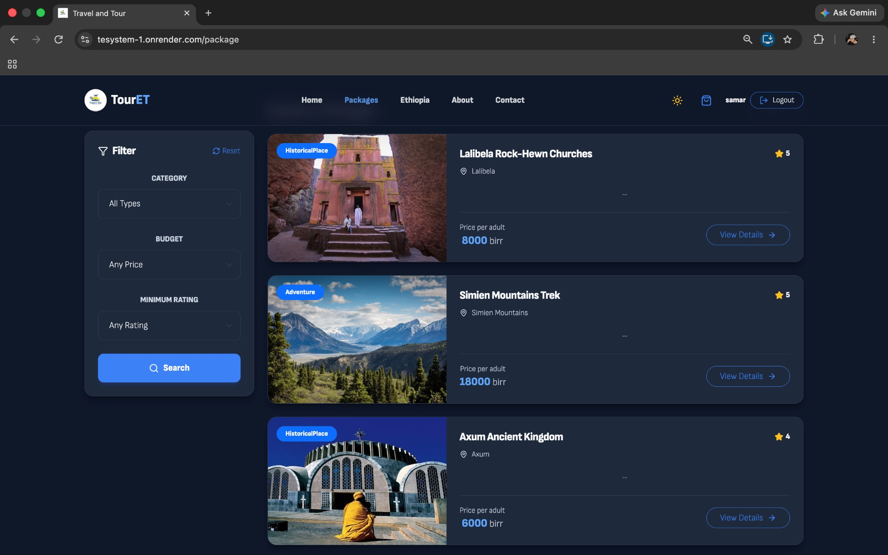
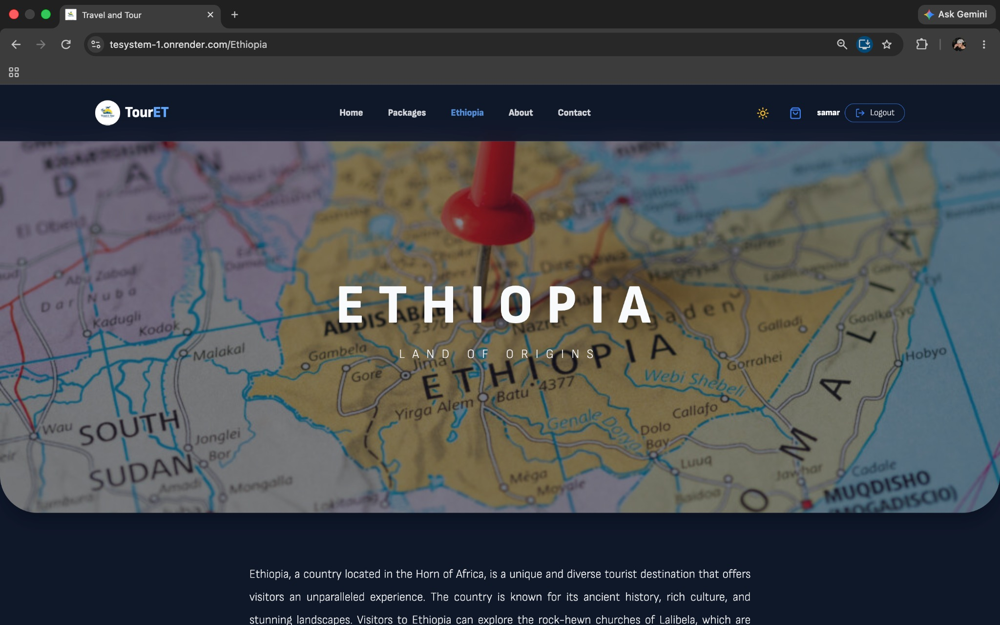
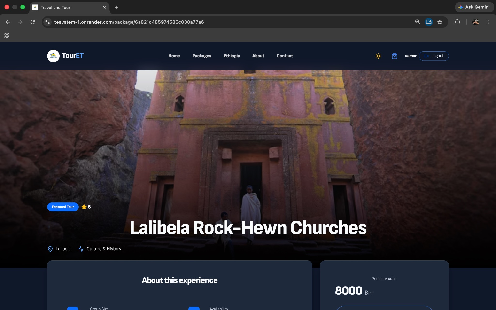
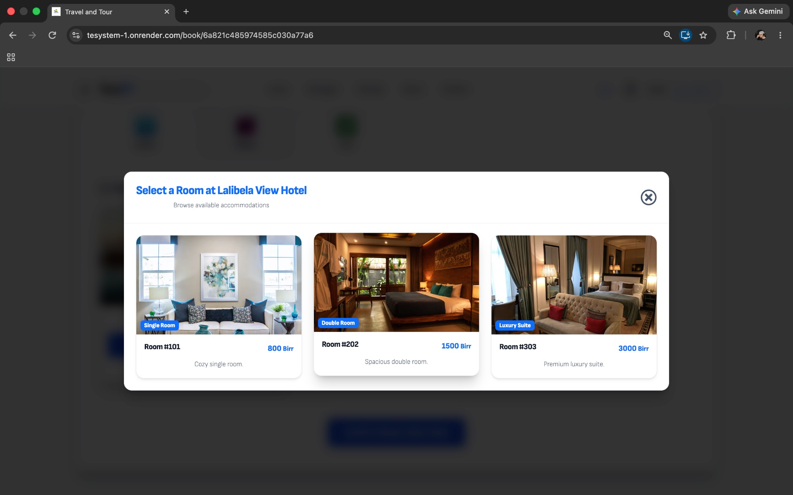
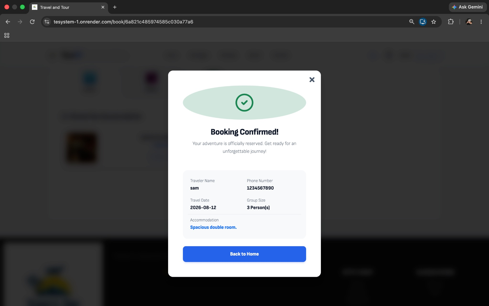

# 🌍 Tour ET : Explore Ethiopia

<p align="center">
  
  
  
  
</p>

**Tour ET** is a premium, full-stack travel platform designed to showcase the majestic beauty of Ethiopia. From the ancient rock-hewn churches of Lalibela to the dramatic Simien Mountains, this application offers an immersive discovery and booking experience.

---

## 🚀 Tech Stack

### Frontend
<p align="left">
  
  
  
  
</p>

### Backend & Database
<p align="left">
  
  
  
  
</p>

---

## ✨ Premium Features

### 🌙 Adaptive Dark Mode
A fully integrated dark mode system that ensures 100% readability and a modern aesthetic across all pages.

### 🗺️ Interactive Discovery
Clickable exploration cards and discovery modals that provide in-depth historical and cultural context for Ethiopia's top destinations.

### 🏨 Advanced Booking System
Real-time price calculation, multi-room selection (Single, Double, Suite), and a secure checkout flow with local payment integrations (Telebirr, CBE Birr).

---

## 📸 UI Preview

### 🏠 Home Page & Discovery
Discover the heart of Ethiopia with our modern, animated interface.
<p align="center">
  
</p>

### 🌓 Dark Mode Experience
Optimized for low-light environments with high-contrast typography.
<p align="center">
  
</p>

### 🇪T Destination Highlights
Explore the Land of Origins through our dedicated cultural sections.
<p align="center">
  
</p>

### 📦 Package Details
Comprehensive tour information with high-quality visual galleries.
<p align="center">
  
</p>

### 🛌 Room Selection
Choose the perfect accommodation from our curated hotel partners.
<p align="center">
  
</p>

### ✅ Booking Confirmation
Seamless reservation process with instant digital confirmation.
<p align="center">
  
</p>

---

## 🛠️ Getting Started

1. **Clone the repository**
   ```sh
   git clone https://github.com/Samarssj/Tour-ET.git
   ```
2. **Install dependencies**
   ```sh
   # Backend
   cd backend && npm install
   # Frontend
   cd ../frontend && npm install
   ```
3. **Environment Setup**
   Configure your `MONGODBURL`, `KEY` (JWT), and `PORT` in the backend `.env`.
4. **Run Application**
   ```sh
   npm start # in both folders
   ```

### Gemini Travel Assistant
The site now includes an **Ask TourET** toggle available throughout the main browsing experience. It sends natural-language trip questions to a server-side assistant endpoint, which grounds suggestions in the current TourET package and hotel catalog.

To enable the live Gemini response locally, copy `backend/.env.example` to `backend/.env`, add a Google AI Studio API key as `GEMINI_API_KEY`, and restart the backend. The server calls Gemini's model-listing endpoint and selects the newest compatible model that supports `generateContent`, caching the result for ten minutes so newer available models are picked up automatically without changing frontend code. The key is never sent to the browser.

---
<p align="center">
  Made with ❤️ for Ethiopia
</p>
