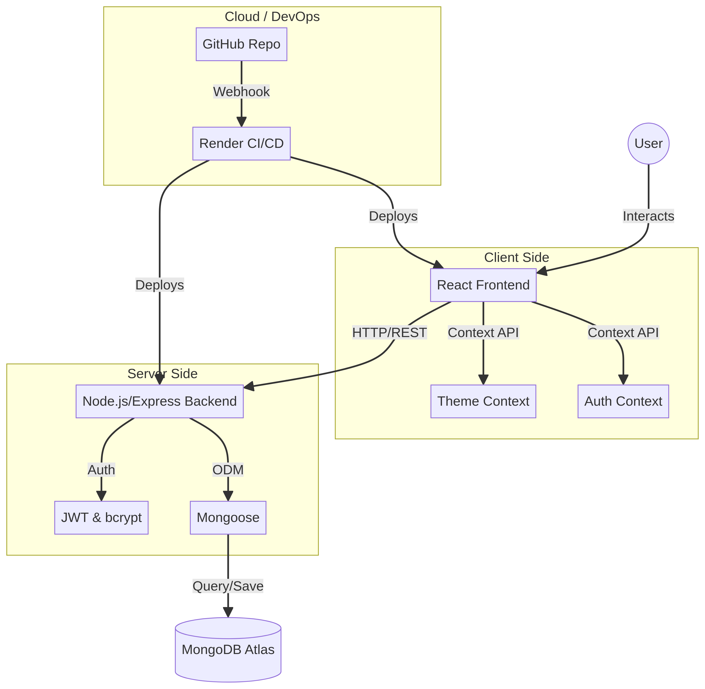

# 🌍 Tour ET : Explore Ethiopia

<p align="center">
  
  
  
  
</p>

**Tour ET** is a state-of-the-art, full-stack interactive travel platform designed to showcase the beauty of Ethiopia. From the historical rock-hewn churches of Lalibela to the modern vibes of Addis Ababa, this application provides a seamless experience for discovering, booking, and reviewing travel packages.

---

## 🚀 Tech Stack

### Frontend
<p align="left">
  
  
  
  
</p>

### Backend & Database
<p align="left">
  
  
  
  
</p>

---

## 🏗️ Architecture Overview



The application follows a modern **Decoupled Architecture**:
- **Frontend**: A React Single Page Application (SPA) serving as the interactive client.
- **Backend**: A Node.js/Express RESTful API handling business logic and authentication.
- **Database**: A cloud-hosted MongoDB Atlas instance for persistent storage.
- **DevOps**: Fully automated CI/CD pipeline integrated with GitHub and Render.

---

## ✨ New Features

### 🌙 Dynamic Dark Mode
Experience the beauty of Ethiopia in any lighting. We've implemented a global **Dark Mode** toggle using React Context and CSS Variables. Your preference is automatically saved to your local storage.

### 🛡️ Production-Ready Security
- **JWT Authentication**: Secure user sessions with JSON Web Tokens.
- **Bcrypt Hashing**: Industry-standard password encryption.
- **CORS Protection**: Secure cross-origin communication between the frontend and backend.

---

## 📸 UI Preview

**Signin/signup page**
<p align="center">

</p>

**Home page**
###### Users can see recent package and most popular package lists and also search by location or name
<p align="center">


</p>

**Package page**
###### Users can see packages and also can filter using different parametes
<p align="center">

</p>

**Package detail page**
###### Users can see package's description, reviews, location, can add to cart, book the package, 
<p align="center">


</p>

**Review page**
###### Authenticated user can give review/comment, rate the package, like/dislike other's review
<p align="center">

</p>

**Book page**
###### Customers check out payment, choose hotel, and room
<p align="center">


</p>

**Witshlist page**
###### Customers can see packages stored in wishlist, remove from here, book here
<p align="center">

</p>

**Contact page**
###### Customers can reach us 
<p align="center">

</p>

**About page**
###### users can know about us
<p align="center">
  
  
</p>

---

## 🛠️ Getting Started

### Prerequisites
- Node.js (v16+)
- npm or yarn
- MongoDB Atlas Account

### Installation
1. Clone the repository
   ```sh
   git clone https://github.com/Samarssj/Tour-ET.git
   ```
2. Install dependencies for both Frontend and Backend
   ```sh
   cd backend && npm install
   cd ../frontend && npm install
   ```
3. Set up your `.env` variables
4. Start the development server
   ```sh
   # In backend
   npm start
   # In frontend
   npm start
   ```

---

## 📄 License
Distributed under the MIT License. See `LICENSE` for more information.

---
<p align="center">
  Made with ❤️ for Ethiopia
</p>
